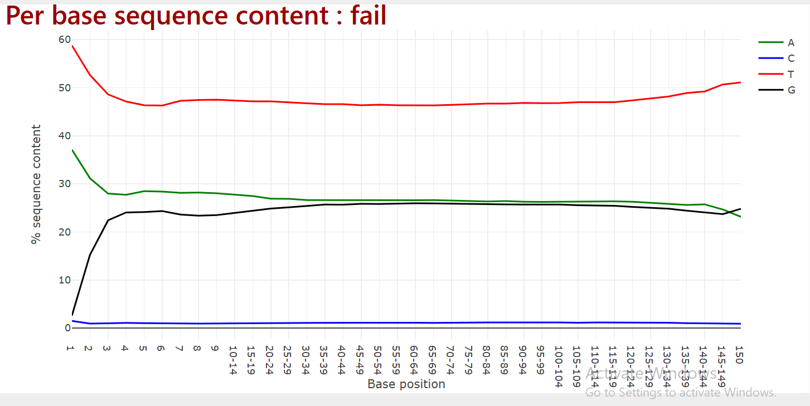
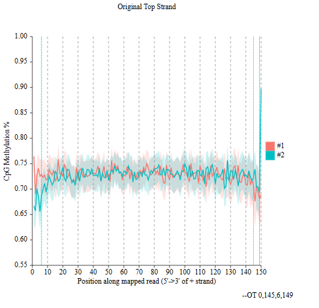
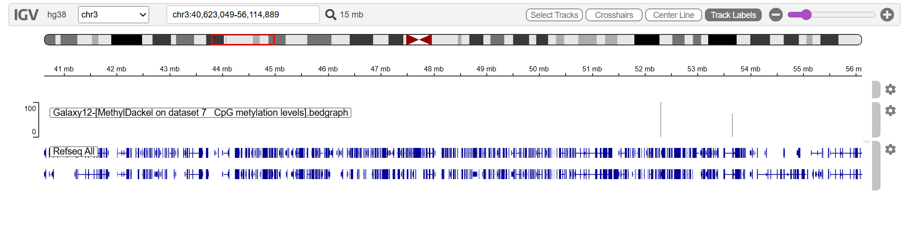
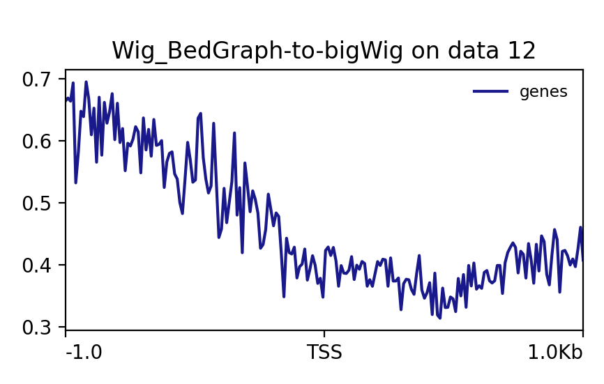
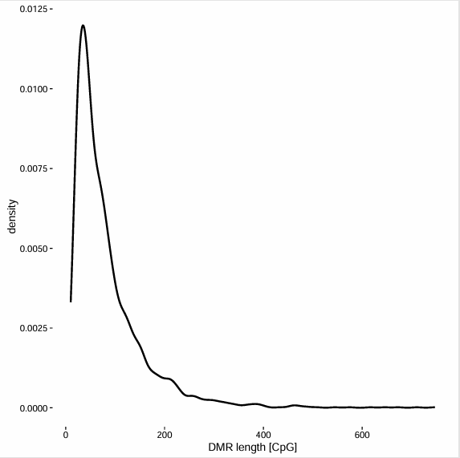

# DNA Methylation Analysis — Bioinformatics Assignment

## Overview

This repository contains the complete analysis for a bioinformatics assignment covering two parts: Whole Genome Bisulfite Sequencing (WGBS) analysis using the Galaxy platform, and EPIC Array aging clock analysis using the Bio-Learn Python library. The assignment is based on the Galaxy Training Network methylation-seq tutorial and the Lin et al. (2015) breast cancer methylation study.

---

## Repository Structure

```
DNA-Methylation-Bioinformatics-Assignment/
├── README.md
├── screenshots/
│   ├── falco_qc.png
│   ├── methylation_bias.png
│   ├── igv_view_png.png
│   ├── plotprofile_output.png
│   └── metilene_output.png
└── output_files/
    ├── falco_report_subset1.zip
    ├── falco_report_subset2.zip
    ├── methylation_output.bedGraph
    ├── plotprofile_allsamples.png
    ├── dmr_results.pdf
    └── dmr_results.txt
```

---

# Part 1: WGBS — Whole Genome Bisulfite Sequencing

## Introduction

Whole Genome Bisulfite Sequencing (WGBS) is the gold standard method for measuring DNA methylation at single-base resolution across the entire genome. In bisulfite sequencing, sodium bisulfite treatment converts unmethylated cytosines to uracil, which are then read as thymine during sequencing. Methylated cytosines remain unchanged. By comparing treated reads to a reference genome, the methylation status of every CpG site can be determined.

This analysis uses a subset of data from Lin et al. (2015), which studied DNA methylation patterns in breast cancer and normal breast tissue samples using WGBS. The samples include normal breast tissue (NB1, NB2) and cancer cell lines (BT089, BT126, BT198, MCF7).

## Platform

Galaxy (usegalaxy.eu / usegalaxy.org)  
Reference Genome: Human hg38

## Dataset

- Source: Lin et al. (2015) — Hierarchical Clustering of Breast Cancer Methylomes Revealed Differentially Methylated and Expressed Breast Cancer Genes
- Data repository: https://zenodo.org/record/557099
- Input files: subset_1.fastq, subset_2.fastq (paired-end bisulfite reads)

---

## Workflow

### Step 1: Data Upload

Paired-end FASTQ files were imported into Galaxy from Zenodo using the Paste/Fetch Data upload tool. The files subset_1.fastq and subset_2.fastq represent bisulfite-treated paired-end sequencing reads from breast tissue.

### Step 2: Quality Control

**Tool:** Falco (Galaxy Version 1.2.4)  
**Input:** subset_1.fastq, subset_2.fastq

Quality control was performed using Falco, a FastQC-compatible tool. The per base sequence content report shows elevated thymine (T) content and near-zero cytosine (C) content across all base positions. This pattern is expected in WGBS data and confirms successful bisulfite conversion of unmethylated cytosines to uracil, subsequently read as thymine during sequencing. The report is marked as fail for per base sequence content, which is normal and expected for bisulfite-treated data.



### Step 3: Alignment

**Tool:** bwameth (Galaxy Version 0.2.7)  
**Reference genome:** Human hg38full  
**Mode:** Paired-end

Reads were aligned to the human reference genome (hg38) using bwameth, a bisulfite-aware aligner. Unlike standard aligners, bwameth handles the C-to-T conversions introduced by bisulfite treatment and correctly maps reads to their true genomic positions without misinterpreting the conversions as mismatches.

### Step 4: Methylation Bias Detection

**Tool:** MethylDackel (Galaxy Version 0.5.2)  
**Mode:** mbias  
**Reference:** Human hg38

MethylDackel was run in mbias mode to detect positional methylation bias along sequencing reads. The bias plot shows CpG methylation percentage at each position along the read for both strands. The plot shows relatively consistent methylation levels across read positions with no severe end bias, indicating the data is of good quality and does not require positional trimming.



### Step 5: Methylation Extraction

**Tool:** MethylDackel (Galaxy Version 0.5.2)  
**Mode:** Extract methylation metrics (BAM/CRAM)  
**Output:** CpG methylation levels in BedGraph format

MethylDackel was run a second time in extraction mode to produce a BedGraph file containing the methylation percentage at every covered CpG site across the genome. The output file contains chromosome coordinates and methylation values for approximately 606,900 CpG regions covering 16.8 MB of the genome.

**Output file:** methylation_output.bedGraph

### Step 6: Visualization

**Tool:** IGV Web App (igv.org/app)  
**Genome:** hg38

The CpG methylation BedGraph file was visualized using the IGV web application. The track shows methylation signal across chromosome 3, with individual CpG sites visible as vertical bars. Higher bars indicate higher methylation percentage at that genomic position. Regions with consistently high methylation correspond to constitutively methylated areas of the genome, while gaps in the track indicate regions with no sequencing coverage in this subset.



### Step 7: CpG Island Profiling — computeMatrix and plotProfile

**Tools:** Wig/BedGraph-to-bigWig, computeMatrix, plotProfile  
**Galaxy Versions:** deepTools 3.5.4  
**Regions:** CpGIslands.bed  
**Mode:** reference-point

The methylation BedGraph files for all six samples (NB1, NB2, BT089, BT126, BT198, MCF7) were converted to BigWig format using the Wig/BedGraph-to-bigWig tool. computeMatrix was then used to compute methylation scores centered on CpG island reference points across all samples. The matrix was used as input for plotProfile to generate methylation profiles across CpG islands.

The plotProfile output shows average methylation levels relative to the transcription start site (TSS) across a 2kb window. Methylation levels are highest upstream of the TSS and decrease sharply at the TSS, consistent with the known biology that CpG island promoters are typically unmethylated in active genes. This pattern is visible across all samples analyzed.



### Step 8: Differential Methylation Analysis

**Tool:** Metilene (Galaxy Version 0.2.6.1)  
**Group 1 (Normal):** NB1_CpG.meth.bedGraph, NB2_CpG.meth.bedGraph  
**Group 2 (Cancer):** BT198_CpG.meth.bedGraph  
**Regions of interest:** CpGIslands.bed

Metilene was used to identify differentially methylated regions (DMRs) between normal breast tissue (NB1, NB2) and cancer tissue (BT198). The tool uses a binary segmentation algorithm to detect regions with statistically significant methylation differences between the two groups.

The DMR length distribution plot shows that the majority of identified DMRs are short, containing fewer than 100 CpG sites, with a sharp peak near 25-50 CpGs. This is consistent with typical DMR length distributions reported in cancer methylation studies, where focal hypermethylation events at gene promoters are common.



**Output files:**
- dmr_results.pdf — DMR distribution plots
- dmr_results.txt — Full list of differentially methylated regions

---

## Output Files Summary

| File | Description |
|------|-------------|
| falco_report_subset1.zip | Quality control report for subset_1.fastq |
| falco_report_subset2.zip | Quality control report for subset_2.fastq |
| methylation_output.bedGraph | CpG methylation levels across the genome |
| plotprofile_allsamples.png | Methylation profile across CpG islands |
| dmr_results.pdf | Differentially methylated region plots |
| dmr_results.txt | Differentially methylated region coordinates |

---

## References

- Lin, I.H. et al. (2015). Hierarchical Clustering of Breast Cancer Methylomes Revealed Differentially Methylated and Expressed Breast Cancer Genes. PLOS ONE. https://doi.org/10.1371/journal.pone.0118453
- Galaxy Training Network. DNA Methylation Data Analysis Tutorial. https://training.galaxyproject.org/training-material/topics/epigenetics/tutorials/methylation-seq/tutorial.html
- Krueger, F. and Andrews, S.R. (2011). Bismark: a flexible aligner and methylation caller for Bisulfite-Seq applications. Bioinformatics.

---
